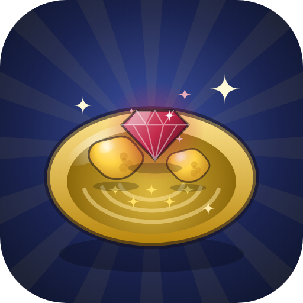

# Pan! – Prospecting Simulator



A prospecting game inspired by Roblox's **Prospecting!**, built as an installable PWA. Play it on iPhone, iPad, Android or desktop, online or offline.

Dig sediment at the deposit, pan it in the water and find minerals. Sell what you find, upgrade your gear and work your way through 13 shores looking for Mythic, Exotic and Celestial finds. The server is filled with simulated players who chat, brag about rare finds, react to yours, place totems you can stand in, and start meteor showers.

## Play / install

Once GitHub Pages is enabled (see below), the game is served at **https://asmyth7274.github.io/Pan/**.

- **iPhone / iPad (Safari):** open the link → Share → **Add to Home Screen**. It then launches full-screen like a native app and works offline.
- **Android (Chrome):** open the link → ⋮ menu → **Install app**.
- **Desktop (Chrome / Edge):** click the install icon in the address bar, or just play in the tab.

Progress saves automatically on each device. You can move a save to another device with **Settings → Export / Import**.

### Enabling GitHub Pages (one time)

Repository **Settings → Pages → Build and deployment → Source: "Deploy from a branch" → Branch: `main` / `(root)` → Save**. The site goes live a minute later.

## The gameplay loop

1. **Dig.** Hold the big gold button and release when the white bar is inside the **gold zone**. Grades are Perfect, Great, Good, Okay and Weak. A better grade gives more sediment and higher *pan quality*, which means more luck and bigger minerals. Consecutive Perfect digs build a **Perfect streak** worth up to +50% luck.
2. **Pan.** When your pan is full you walk to the water, and the button turns into a live close-up of your pan. Hold to shake the sediment out. When a **glint** flashes, release to catch it for +10% luck (up to 5 per pan, with a chance of a bonus item).
3. **Find.** Each pan rolls several minerals. Each one gets a rarity, a weight in kg, a possible modifier and a size class.
4. **Sell and upgrade.** Sell from the Bag or the quick-sell button, then buy better pans, shovels, potions, totems, sluices and outfits.
5. **Explore.** Shovel *toughness*, your level and a travel permit unlock new shores.

## Content

| | |
|---|---|
| **Minerals** | 164, each with procedurally drawn art, across 8 rarities: Common, Uncommon, Rare, Epic, Legendary, Mythic, Exotic and Celestial |
| **Shores** | 13: Rubble Creek, Fortune River, Sunset Beach, Rotwood Swamp, Crystal Caverns, Sunscorched Desert, Frostbite River, Caldera Shore, Fossil Bay, Overgrown Grotto, Meteor Valley, The Void, Celestial Shore |
| **Pans / Shovels** | 15 pans (luck, capacity, shake strength/speed, passives) and 17 shovels (dig strength/speed, toughness). Early tiers use the original game's stats and prices |
| **Modifiers** | 13: Shiny ×1.2, Pure ×1.35, Glowing ×1.6, Frozen ×1.8, Scorching ×2, Irradiated ×2.5, Electrified ×3, Iridescent ×3.5, Ancient ×4, Cursed ×5 (it haunts you while you carry it), Starforged ×6, Voidtorn ×10, Prismatic ×15 |
| **Sizes** | HUGE (3× weight or more) and COLOSSAL (7× or more) |
| **Events** | 13 server events, rolled every 6 minutes. Meteor Shower, River Rapids, Solar Flare, Blizzard, Volcanic Eruption, Mythic Rift, Gold Rush, Aurora Night, Prospector's Blessing and Celestial Convergence are buffs. Thunderstorm, Spectral Fog and Drought mix a buff with a debuff |
| **Buffs** | 12 potions, 6 totems (including a Friendship Totem that scales with the players around you), 14 pan enchants, 19 craftable rings, necklaces and charms with rolled stats, Museum displays, collection bonuses and rebirth multipliers |
| **Debuffs** | Shore hazards (Toxic Fumes, Heatstroke, Frostbite, Scorched, Mosquito Swarm, Radiation, Void Sickness, Blinding Light) that Outfitter gear protects against. Cursed minerals. Mixed events |
| **Systems** | Museum (12 pedestals), Index with live odds, Sluices that keep working while you're offline (up to 8 h), a Travelling Merchant, a day/night cycle with minerals that favour night or day, NPC story quests, daily quests, a 7-day login streak, 45 achievements with titles, codes, rebirth, a leaderboard and Auto-Prospect |
| **Multiplayer feel** | Simulated players who join and leave, prospect on screen beside you, chat (and answer when you talk), announce rare finds, react to yours, place totems and summon meteor showers |

Try the codes `PANNING`, `GOLDFEVER`, `METEOR`, `RELEASE`, `SHINY` and `PROSPECTOR`.

## Tech

- Plain HTML, CSS and JavaScript ES modules. There is no build step and no dependencies.
- All art is drawn procedurally on `<canvas>`: scenes, characters, all 164 mineral icons and the gear icons. All sound is synthesised with WebAudio.
- The service worker (`sw.js`) precaches the whole game so it runs offline.
- The rules (`js/game.js`, `js/loot.js`, `js/stats.js`) don't touch the DOM, so they also run under Node.

```
index.html, css/style.css, manifest.webmanifest, sw.js
js/main.js            boot + game loop
js/game.js            rules & actions          js/loot.js     drop rolls
js/stats.js           stat stacking            js/bots.js     simulated players
js/worldclock.js      day/night, events, merchant
js/data/*             minerals, shores, gear, items, events, quests
js/render/*           scene, characters, icons
js/ui/*               HUD, panels, icons
tools/                economy simulator, smoke test, icon + service-worker generators
```

### Development

```bash
npx http-server . -p 8080 -c-1     # then open http://localhost:8080
node tools/sim.mjs 24              # simulate 24 h of play to check the economy
node tools/smoke.mjs               # headless test of the game rules
node tools/build-sw.mjs            # run after changing files, to refresh the offline cache list
```

*Fan-made and not affiliated with Roblox or the creators of Prospecting!. The Fredoka font is used under the SIL Open Font License.*
